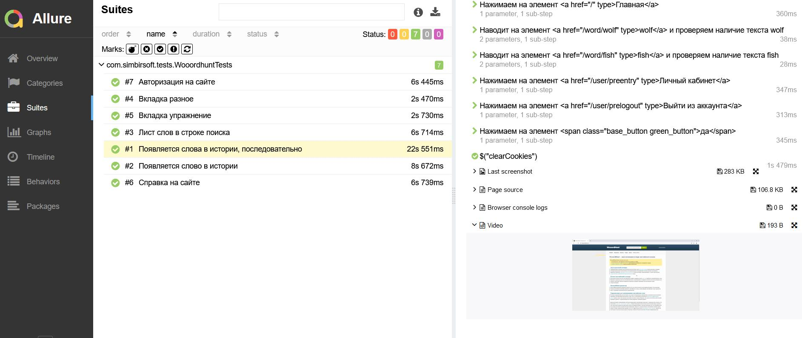
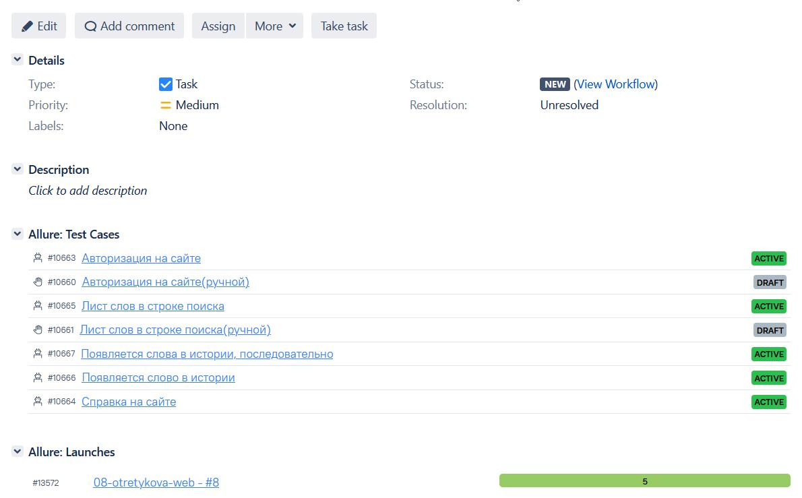

<p align="right">
<a href="https://visitor-badge-reloaded.herokuapp.com/badge?page_id=SimpleCat1.qaGuruDiploma&color=55acb7&style=flat&logo=Github&text=Hello_Visitors!">
  
  
</a>
</p>

# Здесь обычный проект по автоматизации тестирования UI(кнопочек :) )


## :rocket: Технологии и инструменты (наведите на картинку курсором, чтобы прочитать название)

<p  align="center"><code></code>
<code></code>
<code></code>
<code></code>
<code></code>
<code></code>
<code></code>
<code></code>
<code></code>
<code></code>
<code></code>
<code></code></p>
Кратко опишу ,что в проекте реализовано: 

Код написан на `Java` в нем использовался,
`JavaFaker` ,чтобы случайные слова использовались в тестах, а не одни и те же
.`Owner` , для сокрытия данных
.`Allure`, для генерации отчетов
.`Jenkins`- инструмент, чтобы запускать всю сборку с определенными параметрами на удаленном компьютере с хранением отчетов запуска и предыдущих сборок ,а также отправка отчета в `Telegram` и `Allure TestOps`.`Allure TestOps`, где привязывали наши автоматические тесты с тест-кейсами и отправляли результат прохождения из Jenkins -> Allure TestOps -> `Jira`. `Jira`,  где удобно было видеть тот же результат пройденных тест-кейсов по автотестам
.В проекте используется фреймворк `JUnit 5`, тесты могут запускаться удаленно, через `Selenoid`,в котором используется для запуска браузеров контейнеры `Docker`, так и локально (на вашем компьютере) можно запустить.
## :spiral_notepad: Реализованы проверки

### &nbsp;&nbsp;&nbsp;&nbsp;&nbsp;&nbsp; UI

> - [x] *Проверка авторизации на сайте, по тексту на главной странице, после авторизации на сайте*
>- [x] *Справка на сайте есть и работает, у авторизованного пользователя(проверяем по заголовку)*
>- [x] *Релевантность поиска слов в Input на сайте у авторизованного пользователя*
>- [x] *Запоминание слова в столбце истории поиска, которые искали в Input на сайте, у авторизованного пользователя*
>- [x] *Запоминание слов в столбце истоии поиска последовательно, которые искали в Input на сайте, у авторизованного пользователя*
>- [x] *Вкладка "Упражнение" работает, проверяем по заголовку, для неавторизованного пользователя*
>- [x] *Вкладка "Разное" работает, проверяем по заголовку, для неавторизованного пользователя*


## :computer: Запуск тестов из терминала

&nbsp;&nbsp;&nbsp;&nbsp;&nbsp;&nbsp;:green_circle:&nbsp;&nbsp;*Запуск тестов локально, с вашего компьютера, при условии, что у вас установлены окружения*
Скачиваем этот репозиторий и в папке `src/test/resources/config` создаем файл `local.properties`
.С данными
```bash
login= Ваш_login_на_сайте_https://wooordhunt.ru/
password= Ваш_password_на_сайте_https://wooordhunt.ru/
remote= not
```
После в теримнале IntelliJ вводим команду 
```bash
gradle clean test_ui
```
И тесты запустятся, через ваш браузер

&nbsp;&nbsp;&nbsp;&nbsp;&nbsp;&nbsp;:green_circle:&nbsp;&nbsp;*Запуск тестов на вашем удаленном сервере(желательно использовать Selenoid):*

Скачиваем этот репозиторий и в папке `src/test/resources/config` создаем файл `remoteMy.properties`
С данными
```bash
login= Ваш_login_на_сайте_https://wooordhunt.ru/
password= Ваш_password_на_сайте_https://wooordhunt.ru/
remote=yes
remoteUrl= Ваш_url_Selenoid
```
После в теримнале IntelliJ вводим команду
```bash
gradle clean -DtestType=remoteMy test_ui
```
И тесты запустятся, через ваш удаленный браузер

&nbsp;&nbsp;&nbsp;&nbsp;&nbsp;&nbsp;:green_circle:&nbsp;&nbsp;*Запуск тестов в несколько потоков:*

В два потока
```bash
gradle clean -Dthreads=2 -DtestType=remoteMy test_ui
```
В один поток
```bash
gradle clean -Dthreads=1 -DtestType=remoteMy test_ui
```
Больше двух потоков делать нет смысла, тут у меня несколько параллельных тестов, остальные не параллельные

&nbsp;&nbsp;&nbsp;&nbsp;&nbsp;&nbsp;:green_circle:&nbsp;&nbsp;*Запуск в разных браузерах:*

Если нужно запустить в другом браузере, то указываем так
```bash
gradle clean -Dthreads=1 -DtestType=remoteMy -Dbrowser=chrome test_ui
```
или
```bash
gradle clean -Dthreads=1 -DtestType=remoteMy -Dbrowser=firefox test_ui
```

где:
>- [x] *Dbrowser - браузер, в котором будут выполняться тесты (по умолчанию chrome), и по умолчанию будет запускать на максимальном разрешении вашего монитора, а также использоваться последняя версия браузера на вашем же компьютере*
>- [x] *DtestType - указывает на имя файла с настройками окружений, для запуска автотестов, также содержит в себе пароли и логины*
>- [x] *Dthreads - количество потоков, тесты запустятся паралельно, если указано 2 (по умолчанию 1)*

&nbsp;&nbsp;&nbsp;&nbsp;&nbsp;&nbsp;:green_circle:&nbsp;&nbsp;*Сформировать allure отчет после проейденных тестов:*

```bash
allure serve build/allure-results
```

##  Запуск тестов в [Jenkins](https://jenkins.autotests.cloud/job/08-otretykova-web/)

### :pushpin: Параметры сборки

    BROWSER (по умолчанию chrome)(Последняя версия)(максимальный размер вашего монитора)
    BROWSER_VERSION
    TREADS (по умолчанию 1)
    env (окружение, но оно у меня одно, production environment, но оставил, как для выбора, что и это можно настроить)
    testType (файл окружения и паролей)

*Для запуска сборки необходимо указать значения параметров(там где выпадающий список есть, там и меняем) и нажать кнопку <code><strong>*Собрать*</strong></code>*, если выбрали, что нужно.

<p align="center">
  
</p>

*После выполнения сборки, в блоке <code><strong>*История сборок*</strong></code>, напротив номера сборки, появится
значок <code><strong>*Allure
Report*</strong></code>, кликнув по которому, откроется страница с сформированным html-отчетом.*
<p align="center">
  
</p>

##  Отчет о результатах тестирования в [Allure Report](https://jenkins.autotests.cloud/job/08-otretykova-web/allure/)

### :pushpin: Общая информация

*Главная страница Allure отчета, содержит следующие информационные блоки:*

> - [x] <code><strong>*ALLURE REPORT*</strong></code> - отображает дату и время прохождения теста, общее количество пройденных кейсов, а также диаграмму с указанием процента и количества успешных, упавших и сломавшихся в процессе выполнения тестов
>- [x] <code><strong>*TREND*</strong></code> - отображает тренд прохождения тестов от сборки к сборке
>- [x] <code><strong>*SUITES*</strong></code> - отображает распределение результатов тестов по тестовым наборам
>- [x] <code><strong>*ENVIRONMENT*</strong></code> - отображает тестовое окружение, на котором запускались тесты (в данном случае информация не задана)
>- [x] <code><strong>*CATEGORIES*</strong></code> - отображает распределение неуспешно прошедших тестов по видам дефектов
>- [x] <code><strong>*FEATURES BY STORIES*</strong></code> - отображает распределение тестов по функционалу, который они проверяют
>- [x] <code><strong>*EXECUTORS*</strong></code> - отображает исполнителя текущей сборки (ссылка на сборку в Jenkins)

<p align="center">
  
</p>

### :pushpin: Список тестов c описанием шагов и визуализацией результатов

*На данной странице представляется стандартное распределение выполнявшихся тестов по тестовым наборам или классам, в
которых находятся тестовые методы.*

<p align="center">
  
</p>

##  Интеграция с [Allure TestOps](https://allure.autotests.cloud/project/1399/dashboards)

### :pushpin: Основной дашборд

<p align="center">
  
</p>

### :pushpin: Запуски

<p align="center">
  
</p>

### :pushpin: Тест-кейсы

<p align="center">
  
</p>

##  Интеграция с [Jira](https://jira.autotests.cloud/browse/AUTO-1138)

<p align="center">
  
</p>

##  Пример запуска теста в Selenoid

<p align="center">
  
</p>

##  Уведомления о результатах тестирования в Telegram

<p align="center">
  
</p>
